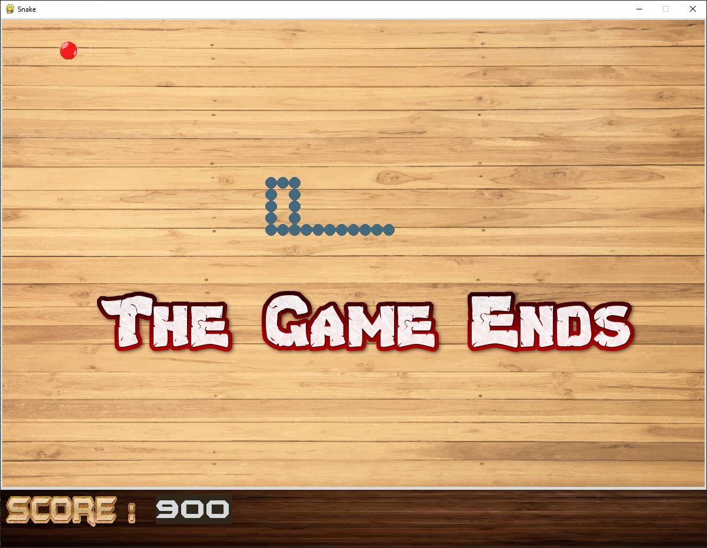

# Snake

This is my implementation of the popular game Snake. This game has been designed using the Python programming language and is powered by the PyGame library.



# Deployment Steps
## Prerequisites
This game requires Python 3.7+ in order to run. Pip is also recommended to enable easy installation of the required package dependencies.

#### Install pygame
```
pip install pygame
```
## Clone the Repository
Use the repository link provided by Github
```
git clone <repo-link>
```

## Running the code
- **Note**: Please do not move out  any __.jpg__ files or the __.ttf__ font file from the same directory as __snakeGame.py__
```
python3 snakeGame.py
